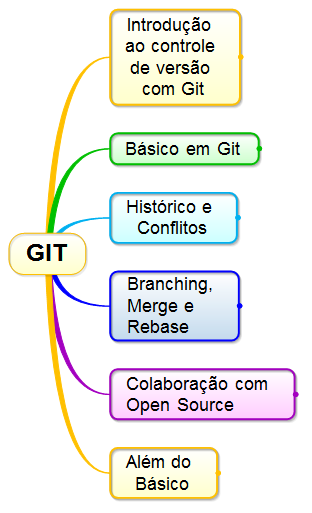

Extensão de arquivo chamada markdown - MD
# Repositório usado no curso de Git e Github.

## Existem vários comandos utilizados.

### Tópicos abordados no curso.

Este repositório serve de exemplos do curso de Git  e Github da Udemy do prof Bruno Orlandi.
